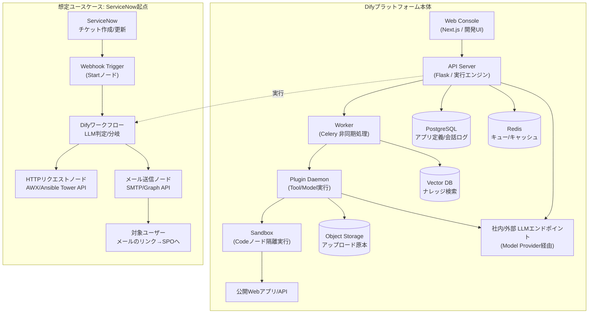
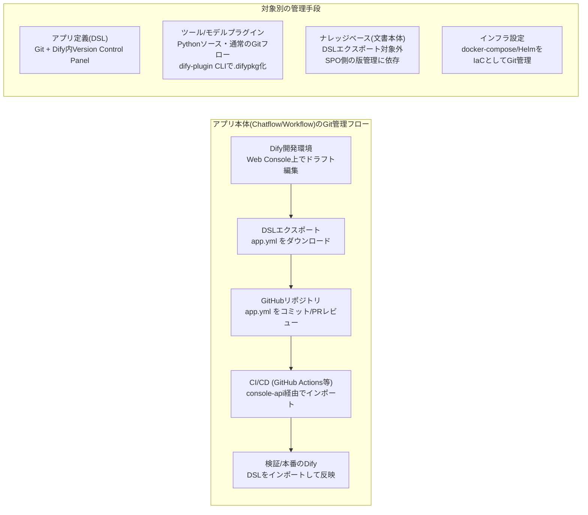

---
{"dg-publish":true,"permalink":"/claude/cowork/dify/","dg-note-properties":{}}
---

---
title: Difyアーキテクチャ・開発運用に関する会話ログ
date: '2026-07-21'
source: cowork-manual-export
tags:
- claude
- cowork
- cat/ml-dl
- cat/python
- cat/react
- cat/devops
- cat/azure
- cat/md
- cat/linux
- cat/windows
---
# Difyアーキテクチャと開発運用に関する会話ログ

> [!info] 概要
> 社内イントラで提供されているDify(AI Agent開発プラットフォーム)を用いて、ServiceNowチケットからAnsible Playbookをキックし、通知メール経由でSPOコンテンツへ誘導するアプリケーションを開発するプロジェクトに関する会話record。Difyのアーキテクチャ、Azure AI Foundry(LangChain/LangGraph)との併用、Git管理の方法、Azureのコンテナレジストリ、参考文献についてまとめている。

---

## 1. Difyのアーキテクチャ全体像

### 質問

Difyが社内のサービス提供元部門からAI Agent開発プラットフォームとして提供されており、ServiceNowチケットからAnsibleのPlaybookをキックしたり、メール通知経由でSPOコンテンツにユーザーを誘導するアプリケーションを開発する必要がある。LangChain/LangGraphのようにコードを書いて動かす場合とは異なり、Difyはローコード/ノーコードであるため、開発環境・プログラムの実体・データモデル・データエンティティ・LLMサービスエンドポイントなどがどのような構成で動作するのかイメージしづらい。アーキテクチャ図を含めて説明してほしい。

### 回答

Difyは、Python/LangChainのようにコードを書いて動かすのではなく、あらかじめ稼働しているサーバー群(Web Console、API Server、Worker、Plugin Daemon、Sandbox)の上で「アプリ定義」というデータ(DSL/YAML形式)を作成・保存し、それをAPI Serverが解釈・実行する構造。開発者が触るのはコードではなく、ノードのグラフ・プロンプト・変数・接続設定といったデータモデル。

**プラットフォーム本体の構成**

- **Web Console**(Next.js) — 開発UI
- **API Server**(Flask) — アプリのグラフを解釈して実行するエンジン
- **Worker**(Celery) — ナレッジベースのインデックス作成やメール送信などの非同期処理
- **Plugin Daemon** — サードパーティのツール・モデルプラグインをサンドボックス実行
- **Sandbox** — Codeノードの隔離実行環境
- **PostgreSQL** — アプリ定義・会話履歴の永続化
- **Redis** — キュー・キャッシュ
- **Vector DB**(Weaviate等) — ナレッジ検索用埋め込み
- **Object Storage** — アップロード原本
- **モデルプロバイダー抽象層** — 社内エンドポイントでも外部API(OpenAI等)でも同一インターフェースでLLMを呼び出せる

**開発時のアーティファクト**

1. アプリ定義(DSL/YAML) — ノード構成・プロンプト・条件分岐
2. ナレッジベース(データセット) — SPO文書等をチャンク化してVector DBへ格納
3. ツール/プラグイン定義 — HTTPリクエスト設定・認証情報
4. 環境変数/シークレット — APIキー、エンドポイントURL

**運用時のアーティファクト**

- 会話・実行ログ
- ワークフロー実行トレース(ノード単位の成否・所要時間)
- 送信された通知メール
- 外部システム(Ansible Tower/AWX等)への呼び出し結果

**想定ユースケースへの当てはめ(ServiceNow起点)**

ServiceNowのチケット作成/更新イベント → Dify Webhook Trigger(Startノード) → ワークフロー内でLLM判定・条件分岐 → HTTPリクエストノードでAnsible Tower/AWXのREST APIを呼び出しPlaybookをキック → 並行してメール送信ノード(SMTP/Graph APIプラグイン)で対象ユーザーに通知、本文中に事前発行したアクセス制御付きSPOリンクを含める。SPO側のアクセス制御自体はDifyの管轄外で、Entra ID/SharePointの権限設定に依存する。

---

## 2. アーキテクチャ図の配色修正

### 質問

図のフォントのフォアグラウンドカラーと背景の黒のコントラストが低すぎて読めない。白背景に暗い色のフォントで描き直してほしい。

### 回答

白背景・濃色文字(固定配色)の図に再描画して提示した(SVG図として提示。本ファイルにはMermaid版の図として上記に反映済み)。

---

## 3. Azure AI Foundry併用時のGit管理

### 質問

このプロジェクトではMicrosoft AI Foundryを併用し、複雑な動的ワークフローが必要なプロセスはLangChain/LangGraph、比較的定型的なワークフローはDifyで開発する予定。AI Foundry上の開発資産はGitHubなどのGitリポジトリで管理する予定だが、Difyの開発アーティファクトも同様にGit管理できるか。Difyの開発資産・バージョン管理はどのようなプラットフォーム・手順で実施するのが典型的か。

### 回答

Difyの開発資産もGit管理は可能だが、AI Foundry側(コードそのものがリポジトリの実体)とは構造が異なり、「Dify内部DBに保存されているアプリ定義」を**エクスポートしたスナップショット(YAML)をGitに置く**という間接的な形になる。

**対象別のバージョン管理手段**

| 対象 | 管理方法 |
|---|---|
| アプリ定義(DSL) | Studio上でYAML(DSL)としてエクスポート/インポート可能。Dify Web Console上でドラフト編集 → DSL(app.yml)をエクスポート → GitHubにコミット・PRレビュー → GitHub ActionsなどからDify内部API(console-api)経由で検証/本番環境にインポート、というのが典型的なCI/CDパターン(※公式のネイティブGit連携機能ではなくコミュニティパターン)。加えてDify内部にも「Version Control Panel」(Draft/Publish管理・リリースノート・ロールバック)があるが、対象はChatflow/Workflowのみで、diff表示やコミットメッセージ相当の機能は弱い。複数環境向けタグベースバージョン管理は現在リクエストされている機能でまだ未実装。 |
| ツール/モデルプラグイン | Pythonコードとして開発するため通常のGitフロー(PR・CI)がそのまま使える。dify-plugin CLIで`.difypkg`としてパッケージ化し、Marketplaceまたは社内プライベートリポジトリで配布。 |
| ナレッジベース(文書本体) | 現状DSLエクスポートの対象外。文書原本(SPO上のコンテンツ)のバージョン管理はDifyの管轄外で、SharePoint側の版管理に依存。 |
| インフラ設定 | docker-compose/Helm等のIaCとして、通常通り別リポジトリでGit管理。 |

**注意点**

- DSLエクスポート時にAPIキー等のSecret型環境変数を含めるか選択できる(既定では含まれないことが多い)ため、機密情報を平文でGitに残さない運用ルールが必要。

**AI FoundryとDifyの構造的な違い**

- AI Foundry側: Pythonコードそのものがgit管理対象。通常のPRレビュー・CI(lint/test)・CD(コンテナデプロイ)がそのまま適用できる。「実行環境=デプロイしたコード=リポジトリの内容」が一致する。
- Dify側: 「実体」はDify内部DB上のアプリ定義。Gitはあくまでエクスポートしたスナップショットの保管場所であり、Dify DBとリポジトリの内容が乖離しうるため、手動同期の運用ルール(エクスポート漏れの防止、インポート後の動作確認など)が必要。

---

## 4. Azure Container Registry

### 質問

Azure Foundryで開発するアプリでは、PostgreSQLを含むChainlitのUIコンポーネントが含まれ、コンテナとしてデプロイされる見込み。Azureのサービスでは、コンテナレジストリの機能が提供されているか。

### 回答

Azure Container Registry(ACR)というマネージドのコンテナレジストリサービスが提供されている。Docker/OCI準拠のイメージ・成果物(Helmチャート等)を保存・管理でき、Basic/Standard/Premiumの3階層(容量・スループット・地理レプリケーションの有無で差別化)がある。

**典型的な構成**

GitHubリポジトリでDockerfile/コードを管理 → GitHub ActionsまたはAzure DevOps PipelinesからACRにビルド済みイメージをpush → Azure Container Apps・AKS(Kubernetes)・App Service(Web App for Containers)といったAzureのコンテナ実行サービスがACRからイメージをpullしてデプロイ。

- 認証: Microsoft Entra ID(サービスプリンシパルやマネージドID)・RBACでレジストリへのアクセスを制御
- 自動化: ACR Tasksでコード変更時・ベースイメージ更新時のイメージ再ビルドを自動化可能
- PostgreSQL部分は、コンテナ内で持たせるよりAzure Database for PostgreSQL(マネージドサービス)を別立てにする構成が本番運用では一般的

---

## 5. 参考文献・書籍

### 質問

上記のようなDify開発運用環境のGitHub連携も含めた内容を学ぶのに良い書籍または文献はあるか(日本語または英語)。

### 回答

「DifyのGitHub連携・バージョン管理・CI/CD運用」に特化した書籍は日本語・英語とも見当たらない。この領域はDify自体が発展途上で、書籍化されるほど確立したベストプラクティスがまだ無いのが実情。

**Dify自体の入門書(日本語)** — いずれも「ノーコードでアプリを作る」観点が中心で、Git連携やCI/CD運用はカバーしていない

- 『ゼロからわかるDifyの教科書』(技術評論社、2025)
- 『【この１冊からはじめる】生成AIアプリ開発入門 Dify 徹底活用ガイド』(SBクリエイティブ)、続編の[実践編]
- 『入門 Dify: 1時間で学ぶ基礎+エージェント・RAG作成』(Kindle)
- 『やりたい！ができる Dify 知識ゼロではじめるAIアプリづくり』(インプレス、2026年3月刊)

英語ではまとまった単行本は見つからず、公式ブログ(dify.ai/blog)や公式ドキュメント(docs.dify.ai)、コミュニティ記事が実質的な情報源。

**Git連携・バージョン管理・運用面(一次情報を推奨)**

- 公式ドキュメントの「Version Control」ページ(docs.dify.ai)とDSL export/importページ(dify-docsリポジトリ)
- langgenius/dify のGitHub Issues/Discussions — 「Tag-based Version Management」(#23639)、「import dsl by api」(#24087)など
- Medium記事「Batch Download of DSL Files for All Dify Apps」

**より広い文脈** — DifyのようなノーコードLLMプラットフォームの運用ガバナンス自体は、一般的なLLMOps/MLOpsの書籍・文献(バージョン管理・環境分離・シークレット管理の原則)を参照し、Difyの具体的な仕組み(DSLエクスポート/インポート)に当てはめて理解するのが現実的。

---

## 参考リンク一覧

- [dify/docker/docker-compose.yaml (langgenius/dify)](https://github.com/langgenius/dify/blob/main/docker/docker-compose.yaml)
- [langgenius/dify | DeepWiki](https://deepwiki.com/langgenius/dify)
- [Webhook Trigger - Dify Docs](https://docs.dify.ai/en/cloud/use-dify/nodes/trigger/webhook-trigger)
- [Introducing Trigger - Dify Blog](https://dify.ai/blog/introducing-trigger)
- [Node Description - Dify Docs](https://docs.dify.ai/guides/workflow/node)
- [Version Control - Dify Docs](https://docs.dify.ai/en/guides/management/version-control)
- [dify-docs: export_import.md](https://github.com/langgenius/dify-docs/blob/main/en/guides/workflow/export_import.md)
- [feat: Add Tag-based Version Management #23639](https://github.com/langgenius/dify/issues/23639)
- [import dsl by api #24087](https://github.com/langgenius/dify/issues/24087)
- [Batch Download of DSL Files for All Dify Apps](https://medium.com/@sato.yuya1211/batch-download-of-dsl-files-for-all-dify-apps-ed927ee04762)
- [Azure Container Registry の概要 - Microsoft Learn](https://learn.microsoft.com/ja-jp/azure/container-registry/container-registry-intro)
- [Azure Container Registry SKU の機能と制限 - Microsoft Learn](https://learn.microsoft.com/ja-jp/azure/container-registry/container-registry-skus)
- [Azure Container Registry | Microsoft Azure](https://azure.microsoft.com/ja-jp/products/container-registry)
- [ゼロからわかるDifyの教科書 - 技術評論社](https://gihyo.jp/book/2025/978-4-297-14836-2)
- [生成AIアプリ開発入門 Dify 徹底活用ガイド - SBクリエイティブ](https://www.sbcr.jp/product/4815632991/)
- [生成AIアプリ開発入門 Dify 徹底活用ガイド [実践編] - SBクリエイティブ](https://www.sbcr.jp/product/4815636586/)
- [入門 Dify (Kindle) - Amazon.co.jp](https://www.amazon.co.jp/dp/B0D97RPZ31)
- [やりたい！ができる Dify 知識ゼロではじめるAIアプリづくり - インプレス](https://www.impress.co.jp/newsrelease/2026/03/20260324-02.html)
